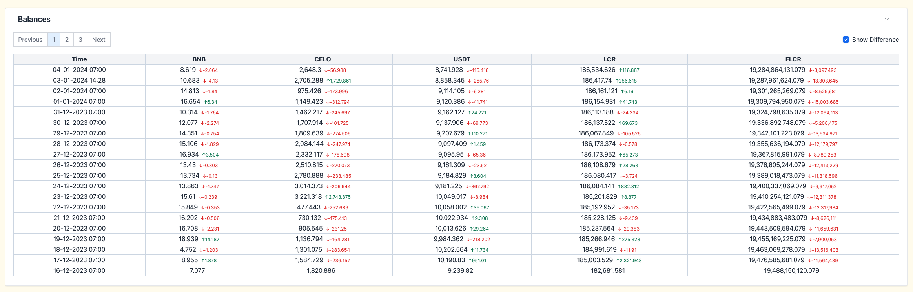
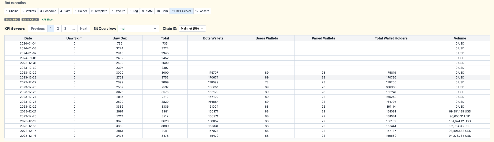
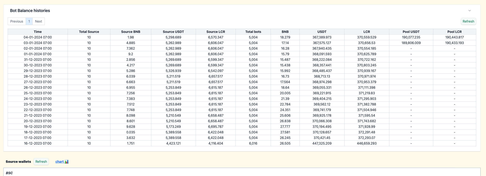

# Documents

## 1. Project Architecture

chain-info/

_`Contains ABIs and map addresses (LCR, LCROperator, LCRRouter02,...)`_

configs/

`Holds the static configuration settings for the project.`

database/

_`Includes commands for backup, connecting to the database, etc.`_

utils/

_`Contains common modules like swap, transfer, etc. It includes the following subdirectories:`_

- `dex/`
- `wallet/`
  - `ERC20.js`
  - `ERC721.js`
  - `Native.js`

server/

_`Folder contain all API of project`_

- `routes`
  - `dex.js`
  - `asset.js`
  - `config.js`
  - ...

src/

_`Source code logic of jobs, model, scripts,...`_

- **`balanceExchangeRate`**: Code of **AMM** tool
- **`dex`**: Logic code of **Bot DEX** new version have gas optimizes (Job queue agenda)
- **`fakeActives`**: Logic code of **SKIM**
- **`handlers`**: A centralized place for commons handlers to be reused many times and in many places
- **`holder`**: Logic code of schedule job queue for +/- **Holders**
- **`jobs`**: Code section DEX old
- **`models`**: All **models** of project
- **`reports`**: Logic report balance wallet and recovery assets to **Source Wallets**
- **`scripts`**: All scripts of the project like dex, withdraw, skim,...
- **`templates`**: Logic generate templates for DEX old, Free Coin DEX and generate ExecuteDex for new version DEX.

utils/

_`Code for each part is usually declared here for reuse many times and constants are also kept here.`_

- `blockchain.js`
- `constant.js`
- `...`

## 2. Jobs daily, weekly

### 2.1.Job `DEX` daily

DEX bot that runs daily will rely on UAW KPI and Volume KPI

1. Schedule by API: `[POST]/dex/schedule` -> [server/routes/dex.js](server/routes/dex.js#L61)
2. After create a schedule will have a record in DB table model [ScheduleDex](src/models/ScheduleDex.js)
3. Setting daily scan schedule for `DEX` [here](src/dex/agendaDex.js#L47) it will call [enableScheuleDexAutoDaily()](src/dex/schedules/dex.js#L5) function to set run time of daily scan.
4. Daily there will be a job that scan all schedule DEX for current day [NAME_JOB.dex.schedule_dex_auto_daily](src/dex/definitions/dex.js#L8)
5. Will call [generateExecuteDexDaily()](src/dex/services/schedule.js#L14) function to perform the scan and if scheduled for the current day will proceed to create the execute
6. In `generateExecuteDexDaily` function will [call](src/dex/services/schedule.js#L34) to [generateExecuteDex](src/templates/generateDex.js#L20) function to create the number of [ExecuteDex](src/models/ExecuteDex.js) to meet the UAW KPI and these `ExecuteDex` will be scheduled to run at a random time. `generateExecuteDex` function will use the new DEX mechanism with 4 wallets forming a set (Index is 4 adjacent numbers).
7. After creating many `ExecuteDex` and setting up the runtime, there will be a job queue [NAME_JOB.dex.schedule_execute_jobs](src/dex/definitions/dex.js#L30) automatically scans and carries out the next job.
8. Every time it's time to run the Job, the [scheduleExecuteJobs](src/dex/services/execute.js#L23) function will be called. This function will create a script to run for `ExecuteDex`, separated into small steps of jobs such as (`transfer_token_from_source`, `swap_token_our_dex`,...). The number of small job steps inside can be from 4 to 12 steps depending on each wallet set and balance conditions
9. The small steps will run sequentially from `job_index` = [0](src/dex/services/execute.js#L302) by create a job to queue and execute follow [name_job](src/dex/definitions/dex.js#L41)([`transfer_token_from_source`](src/dex/definitions/dex.js#L41),[`swap_token_to_token_our_dex`](src/dex/definitions/dex.js#L45)). Each time a small step is completed, it will check to see if there is a next step, it will create a runtime schedule for the next step by [scheduleNextJobDex()](src/dex/services/execute.js#L478). Just like that until all `job_index` are completed.

### 2.2.Job `SKIM` daily

SKIM bot that runs daily will rely on UAW KPI and configuration

1. Schedule by API: `[POST]/fake_actives/uaw/daily` -> [server/routes/fakeActives.js](server/routes/fakeActives.js#L100)
2. After create a schedule will have a record in DB table model [ExecuteFakeActivesModel](src/models/ExecuteFakeActives.js)
3. Setting daily scan schedule for `SKIM` [here](src/fakeActives/jobsSkim/agendaSkim.js#L29) it will call [enableScheuleFakeActivesDaily()](src/fakeActives/jobsSkim/schedules/fakeActives.js#L5) function to set run time of daily scan.
4. Daily there will be a job that scan all schedule SKIM for current day

   - [NAME_JOB.fake_actives.schedule_fake_actives_daily](src/fakeActives/jobsSkim/definitions/fakeActives.js#L17)
   - [NAME_JOB.fake_actives.schedule_fake_actives_daily_free_coin](src/fakeActives/jobsSkim/definitions/fakeActives.js#L21)

5. Both 2 jobs will call to [scheduleFakeActivesDailyCommon()](src/fakeActives/jobsSkim/definitions/fakeActives.js#L76) -> Next, the inside will call to [scheduleFakeActivesDaily()](src/fakeActives/jobsSkim/services/scheduleFakeActives.js#L25)
6. In `scheduleFakeActivesDaily` will query in DB to see if there is any scheduled for the current day or no. If there are scheduled it will create a job to queue `NAME_JOB.fake_actives.schedule_fake_actives` [code](src/fakeActives/jobsSkim/services/scheduleFakeActives.js#L36)
7. Content of Job [NAME_JOB.fake_actives.schedule_fake_actives](src/fakeActives/jobsSkim/definitions/fakeActives.js#L45) will call to [scheduleFakeActives()](src/fakeActives/jobsSkim/services/scheduleFakeActives.js#L101) function will params is config get from DB.
8. In [`scheduleFakeActives()`](src/fakeActives/jobsSkim/services/scheduleFakeActives.js#L101) function will be the main logic to create `SKIM` jobs and buff gas fee for `SKIM` execution.
9. Each `SKIM execution` job will be scheduled to run at a random time of day and they will also be completely separate and unrelated to each other like DEX execution jobs.
10. Queue will continuously scan if it detects jobs [NAME_JOB.fake_actives.execute_fake_actives](src/fakeActives/jobsSkim/definitions/fakeActives.js#L37) and [NAME_JOB.fake_actives.execute_fake_actives_free_coin](src/fakeActives/jobsSkim/definitions/fakeActives.js#L41) until runtime the `SKIM` job will be put into execution.
11. Both jobs execute will call to [executeFakeActivesCommon()](src/fakeActives/jobsSkim/definitions/fakeActives.js#L88) -> Next inside will check wallet need to execute and call to [executeFakeActives()](src/fakeActives/jobsSkim/services/executeFakeActives.js#L19)
12. In [`executeFakeActives()`](src/fakeActives/jobsSkim/services/executeFakeActives.js#L19) function will be the main logic execute transaction `SKIM` of a wallet -> to create a UAW on-chain

### 2.3. Job `Holder` daily

Holders that runs daily will rely on Holder KPI to +/- holders

1. Schedule by API: `[POST]/fake_holder/` -> [server/routes/fakeHolder.js](server/routes/fakeHolder.js#L44)
2. After create a schedule will have a record in DB table model [ExecuteFakeHoldersModel](src/models/ExecuteFakeHolders.js)
3. Daily there will be a job that scan all schedule `Holder` for current day [NAME_JOB.holder.schedule_fake_holders_daily](src/holder/definitions/holder.js#L11). Setting time for job daily scan shedule holder by [enableScheuleFakeHoldersDaily()](src/holder/agendaHolder.js#L47) -> call to define of job [`enableScheuleFakeHoldersDaily`](src/holder/schedules/fakeHolders.js#L5)
4. In define of job [`NAME_JOB.holder.schedule_fake_holders_daily`](src/holder/definitions/holder.js#L11) inside call to [scheduleFakeHoldersDailyCommon()](src/holder/definitions/holder.js#L66) function. Next call to [scheduleFakeHoldersDaily()](src/holder/services/scheduleFakeHolders.js#L28)
5. Content `scheduleFakeHoldersDaily()` function will query in DB scheduled of the current day. If there are schedules it will creata a job [`NAME_JOB.holder.schedule_fake_holders`](src/holder/services/scheduleFakeHolders.js#L40)
6. In define of job [`NAME_JOB.holder.schedule_fake_holders`](src/holder/definitions/holder.js#L19) will call to [scheduleFakeHolders()](src/holder/services/scheduleFakeHolders.js#L54) function. This is function will detect between tagret Holders KPI and number Holders current. If need to increase will call [scheduleFakeIncreaseHolders()](src/holder/services/scheduleFakeHolders.js#L97) function to increase number holders more and call to [scheduleFakeReduceHolders()](src/holder/services/scheduleFakeHolders.js#L185) if need reduce number holders.
7. Both the increase and need holders will create a count execution owner to meet the target holders and each job will have a separate scheduled run time.
8. In job crease holder will execute by job [`NAME_JOB.holder.withdraw_increase_holders`](src/holder/services/scheduleFakeHolders.js#L130) and define [withdraw_increase_holders](src/holder/definitions/holder.js#L31) job will call to [withdrawIncreaseHolders()](src/holder/services/executeFakeHolders.js#L28) function. This function will request to server of game to withdraw token to increase number holders.
9. On the contrary [`NAME_JOB.holder.deposit_reduce_holders`](src/holder/definitions/holder.js#L36) have the effect of reduce the number of holders by call to [depositReduceHolders()](src/holder/services/executeFakeHolders.js#L120) function. This function will create a transaction `deposit` token into the game to reduce the number of holders.

### 2.4. Job `scanLogsAndFakceTransacions` daily

The job will check to see if there have been any DEX transactions in the past 2 hours. Otherwise, it will automatically fake any sell or buy transaction using AMM's wallet.

1. Setting job [scanLogsAndFakceTransacions](src/jobs/agenda.js#L52) will set run time of job.
2. In define job [`NAME_JOB.fake_transactions.repeat_scan_logs`](src/jobs/definitions/fakeTransactions.js#L6) will call [scanLogsAndFakeTransactions()](src/fakeTransactions/scanLogsAndFakeTransactions.js#L13) to execute fake transactions

### 2.5. Job `cacheBalancesAll` daily

This job will cache the entire balance of Source, Spending, AMM, Beta wallets at the beginning of the day in detail so that it can be easily tracked over a long period of time.

- <https://qwerty.stg.blcr.xyz/bot/assets>
- 

1. Setting job [cacheBalancesAll](src/jobs/agenda.js#L53) will set run time of job.
2. In define job [`NAME_JOB.cache.cache_balance_source_all`](src/jobs/definitions/cacheData.js#L8) will call [cacheBalanceAll()](src/handlers/assetsRecovery.js#L565) to cache data to DB

### 2.6. Job `cacheKpiServerToReport` daily

This job will cache both SKIM and DEX's UAW KPIs recorded for each day into a [`ReportExecuteModel`](src/models/ReportExecute.js) table

- <https://qwerty.stg.blcr.xyz/bot/botKpiServer>
- 

1. Setting job [cacheKpiServerToReport](src/jobs/agenda.js#L54) will set run time of job.
2. In define job [`NAME_JOB.cache.cache_kpi_server`](src/jobs/definitions/cacheData.js#L19) will call [cacheKpiServerAll()](src/handlers/functions.js#L528) -> [cacheKpiServerFromLogsToReportExecute()](src/handlers/functions.js#L405) function to cache data to DB

### 2.7. Job `backupDatabase` daily

This job will backup data from the last 5 days and `logs` data from the past longer than 5 days will be deleted to reduce the storage size of the DB.

1. Setting job [backupDatabase](src/jobs/agenda.js#L55) will set run time of job.
2. In define job [`NAME_JOB.cache.backup_database`](src/jobs/definitions/cacheData.js#L30) will call [backupAndManageDatabase()](src/handlers/backupDB.js#13) function to backup data of DB to folder `database/backups/`

### 2.8. Job `cacheBalancesDex` daily

This job will cache all balances of Source Wallets, all DEX bots and Pair addresses to easily track the inflow and outflow of the DEX execution process.

- <https://qwerty.stg.blcr.xyz/bot/assets>
- 

1. Setting job [cacheBalancesDex](src/dex/agendaDex.js#L56) will set run time of job.
2. In define job [`NAME_JOB.cache.cache_balances_dex`](src/dex/definitions/dex.js#L49) will call [cacheReportBalanceDex()](src/dex/services/report.js#L76) function to cache data to DB.
